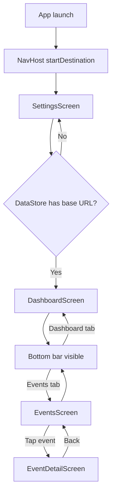

# Frigate Event Viewer — UI Map

**This file is the source of truth for Compose UI and navigation.** See `map.md` for project structure and data flow.

---

## Rules for AI

Whenever a new screen or navigation route is added to the app, the AI agent **MUST** update this document and its Mermaid flowcharts to reflect the new architecture before marking the task as complete.

---

## 1. Navigation flowchart

**Flow summary:**

- **App launch:** NavHost starts at route `"settings"`.
- **Launch decision:** A `LaunchedEffect(Unit)` in MainActivity calls `SettingsPreferences.getBaseUrlOnce()`. If non-null, navigates to `"dashboard"` and pops `"settings"` so back does not return to first-run.
- **First run:** User stays on SettingsScreen until they enter a URL and tap Save (or launch decision already sent them to dashboard).
- **After Save:** `onNavigateToDashboard` runs → navigate to `"dashboard"`, pop `"settings"` inclusive.
- **Bottom bar:** Shown only when current route is `"dashboard"` or `"events"`. Hidden on `"event_detail"`. Tapping Dashboard or Events uses `launchSingleTop` with save/restore state.
- **Event detail:** From EventsScreen, tapping an event card sets `SharedEventViewModel.selectedEvent` and navigates to `"event_detail"`. EventDetailScreen shows video, actions (Mark Reviewed, Keep, Delete), and metadata. Back (toolbar or system) clears selection and pops to the previous screen.

---

## 2. Screen inventory

### SettingsScreen

- **Route:** `"settings"`
- **Purpose:** First-run / onboarding. User enters the Frigate Event Buffer server base URL, can test connection (GET `/status`), and saves. After save, app navigates to dashboard and removes settings from back stack.
- **ViewModel:** `SettingsViewModel` (factory: `SettingsViewModelFactory`).
- **States:**
  - `urlInput: StateFlow<String>` — current text in the URL field.
  - `connectionTestState: StateFlow<ConnectionTestState>` — `Idle` | `Loading` | `Success` | `Error(message)`.
- **Data source:** `FrigateApiService.getStatus()` for "Test connection". DataStore for `saveBaseUrl` / `getBaseUrlOnce`.

---

### DashboardScreen

- **Route:** `"dashboard"`
- **Purpose:** Shows event stats (today, this week, this month, unreviewed) and storage usage. Pull-to-refresh and retry on error.
- **ViewModel:** `DashboardViewModel` (factory: `DashboardViewModelFactory`).
- **States:** `DashboardState` — `Loading(previous?)` | `Success(stats)` | `Error(message, previous?)`.
- **Data source:** `FrigateApiService.getStats()`.

---

### EventsScreen

- **Route:** `"events"`
- **Purpose:** Lists unreviewed events with thumbnails (snapshot or clip), camera name, timestamp, label, and threat level. Retry on error.
- **ViewModel:** `EventsViewModel` (factory: `EventsViewModelFactory`).
- **States:** `EventsState` — `Loading` | `Success(response)` | `Error(message)`. Also exposes `baseUrl: StateFlow<String?>` for building media URLs.
- **Data source:** `FrigateApiService.getEvents(filter = "unreviewed")`.

---

### EventDetailScreen

- **Route:** `"event_detail"`
- **Purpose:** Plays the event's .mp4 clip (Media3 ExoPlayer), shows actions (Mark Reviewed, Keep, Delete), and metadata (title, scene, camera, date, threat level). User can mark viewed, keep (move to saved), or delete; on Keep or Delete success the screen pops back (path changes / item removed). Selection comes from `SharedEventViewModel`; cleared on back.
- **ViewModel:** `EventDetailViewModel` (factory: `EventDetailViewModelFactory`). Also reads `SharedEventViewModel.selectedEvent` (from MainActivity).
- **States:** `EventDetailOperationState` — `Idle` | `Loading` | `Success(action)` | `Error(message)`. `baseUrl: StateFlow<String?>` for building clip URL.
- **Data source:** `FrigateApiService.markViewed`, `keepEvent`, `deleteEvent`. Clip URL via `buildMediaUrl(baseUrl, hosted_clip)` or first `hosted_clips[].url`.

---

## 3. UI components and helpers

### buildMediaUrl(baseUrl, path)

- **Location:** `com.example.frigateeventviewer.ui.util.MediaUrl.kt`
- **Purpose:** Builds the full media URL from the server base URL and an API path (e.g. `hosted_snapshot`, `hosted_clip`). Trims trailing slash from base URL to avoid double slashes. Returns `null` if either argument is null/blank.
- **Used by:** EventsScreen `EventCard` for thumbnail/clip URLs; EventDetailScreen for clip playback URL.

### EventDetailScreen — video and actions

- **Video:** AndroidView wrapping Media3 `PlayerView` and `ExoPlayer`. Clip URL from `buildMediaUrl(baseUrl, event.hosted_clip)` or first `event.hosted_clips[].url`. Player is paused on lifecycle `ON_PAUSE` (so audio does not continue in background) and released in AndroidView `onRelease`.
- **Actions:** Row of three buttons — Mark Reviewed (primary), Keep (tertiary; disabled if `event.saved`), Delete (error). Success(Delete) or Success(Keep) triggers pop back; Success(Mark Reviewed) shows Snackbar and stays.

### Coil and video thumbnails

- **Application:** `FrigateEventViewerApplication` implements Coil `ImageLoaderFactory` and registers `VideoFrameDecoder.Factory()` so video URLs (e.g. .mp4 clip paths) can be used as image sources (first frame decoded).
- **Usage:** Use the default Coil `ImageLoader` (do not create ad-hoc loaders). For video URLs, build an `ImageRequest` with `videoFrameMillis(2000L)` (or desired offset) so Coil uses the decoder to show a frame. Example: EventsScreen `EventCard` uses `AsyncImage` with `ImageRequest.Builder(context).data(url).videoFrameMillis(2000L).build()`.
- There is no separate "StreamingVideoFetcher" component; the app uses Coil’s `VideoFrameDecoder` as above.
