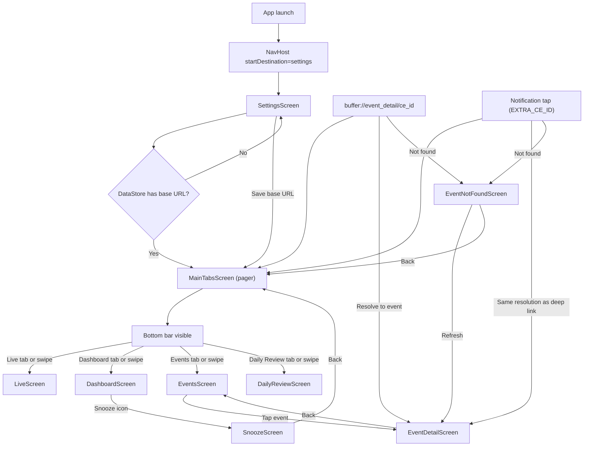

# Frigate Event Viewer — UI Map

**This file is the source of truth for Compose UI and navigation.** See `map.md` for project structure and data flow.

---

## Rules for AI

Whenever a new screen or navigation route is added to the app, the AI agent **MUST** update this document and its Mermaid flowcharts to reflect the new architecture before marking the task as complete.

---

## Design System & UI Guidelines

Apply these rules across all screens to keep the app visually consistent. **All new screens and UI (e.g. Live tab, new settings fields) must follow this Design System** — container margins, typography, shapes, spacing.

- **Screen headers:** The main tab screens (Live, Dashboard, Events, Daily Review) use a large top-app-bar style title at the top of their main content: `MaterialTheme.typography.headlineLarge`, with **16.dp** horizontal and top padding and **8.dp** bottom spacing before the body content. Main screen headers include a **settings navigation icon on the right** that navigates to the settings route; when on the **Dashboard** tab, a **Snooze** icon (NotificationsOff) is also shown and navigates to the snooze route. Back from Settings or Snooze returns to the main tabs.
- **Nested screens (Settings, Event detail):** Use a **TopAppBar** with title and **navigationIcon** = `IconButton` + `Icons.AutoMirrored.Filled.ArrowBack` for consistent back styling. These screens also use **full-width swipe-back** via **SwipeBackBox** (see `ui/util/SwipeBack.kt`): a rightward swipe from anywhere on the screen triggers back (same feel as swiping between tabs). Vertical scroll is preserved: the gesture is only consumed when horizontal movement exceeds the threshold and dominates vertical movement.
- **Container margins:** Main screen containers use uniform **16.dp** horizontal padding so content aligns cleanly to the screen edges. Avoid double-padding inner children (e.g. do not add extra horizontal padding inside a Column that already sits in a padded container).
- **Shapes:** Major UI elements (video players, cards, action buttons) use **12.dp** rounded corners: `RoundedCornerShape(12.dp)`. Do not use the default Compose pill shape for primary action buttons; use the 12.dp shape to match video and cards.
- **Action buttons:** Rows of action buttons must stay **single-line** at **40.dp** height. Use `Modifier.height(40.dp)` and `Text(..., maxLines = 1)`. When button labels vary in length, use `Modifier.weight(...)` so the middle/longer label has more space (e.g. `weight(1.4f)` for "Mark Reviewed") and side buttons use `weight(1f)` to avoid wrapping.
- **Video players:** Use a **16:9** aspect-ratio container (`Modifier.aspectRatio(16f / 9f)`), **RESIZE_MODE_ZOOM** so the frame is filled, and a **1-second (1000ms)** controller timeout (`controllerShowTimeoutMs = 1000`). **Landscape:** When the device is horizontal, the event-detail and dashboard recent-event video viewers use the full content height (below status bar and header), **RESIZE_MODE_FIT** (fit scaling, no zoom), and the same controller timeout; portrait behavior is unchanged.
- **Push notifications:** Security-alert notification content follows the same title/body hierarchy as in-app UI: concise title (e.g. "Motion Detected", "Snapshot ready", or AI title) and body text. The notification shade uses `NotificationCompat` setContentTitle/setContentText (and BigPictureStyle where applicable); no Compose typography in the shade. See `FrigateFirebaseMessagingService` and `map.md` §5 (FCM phase-aware notifications).
- **Stat cards / metric cards:** Dashboard-style cards that show a label and a numeric (or short) value must keep spacing consistent. Use a content **Column** with **Modifier.fillMaxWidth()** so the label and value are centered in the full card width (not left-aligned). Put the label on top (e.g. `labelMedium`), then a fixed gap (e.g. **4.dp**), then a **fixed-height value region** (e.g. `Box` with `Modifier.fillMaxWidth()` and `Modifier.heightIn(min = 32.dp)`) with the value **centered** (vertical and horizontal) so one-digit and multi-digit values align consistently. Reference: Dashboard `StatCard` in `DashboardScreen.kt`.
- **Full-width filter/toggle buttons:** Used for mode toggles (e.g. Events tab Reviewed/Unreviewed). Place within the screen’s **16.dp** horizontal padding; **Modifier.fillMaxWidth().height(40.dp)**; **RoundedCornerShape(12.dp)**; single-line label. Use `OutlinedButton` or secondary-style `Button`. Example: EventsScreen toggle "View Reviewed Events" / "View Unreviewed Events".

---

## State that survives configuration changes (rotation)

When a screen needs **state that must survive configuration changes** (e.g. rotation)—such as selected camera, filter mode, or tab index—use an **activity-scoped** ViewModel with **SavedStateHandle**.

**How to implement:**

1. **ViewModel + Factory:** Give the ViewModel a factory that accepts `SavedStateHandle` (and any other dependencies). In the ViewModel constructor, use `SavedStateHandle` to persist and restore the key state (e.g. `get<String>("key")` / `set("key", value)`).
2. **Create in MainActivity:** Create the ViewModel at the top level of `setContent` with:
   - `viewModel(viewModelStoreOwner = activity, factory = YourViewModelFactory(...))`
   - This scopes the ViewModel to the Activity so it is not tied to a NavBackStackEntry that may be recreated on rotation.
3. **Pass down:** Pass the ViewModel instance into the composable that hosts the screen (e.g. MainTabsScreen), then into the screen composable (e.g. LiveScreen). The screen should declare `viewModel: YourViewModel` as a **required** parameter with **no default** `viewModel(...)` call.
4. **Do not:** Create such ViewModels inside the screen with `viewModel(factory = ...)` and no explicit owner. The default owner is the NavBackStackEntry; its lifecycle and saved state may not restore correctly on configuration change, so selection or mode can reset.

**Reference implementations:**

- **Events tab:** `EventsViewModel` is created in MainActivity with `viewModelStoreOwner = activity` and `EventsViewModelFactory(sharedEventViewModel)`; filter mode (Reviewed/Unreviewed) is stored in SavedStateHandle. Passed via MainTabsScreen into EventsScreen.
- **Live tab:** `LiveViewModel` is created in MainActivity with `viewModelStoreOwner = activity` and `LiveViewModelFactory()`; selected camera is stored in SavedStateHandle. Passed via MainTabsScreen into LiveScreen.
- **Main tabs:** `MainTabsViewModel` (selected tab index) follows the same pattern; it is activity-scoped so the selected tab survives rotation.

When adding a **new** screen that needs rotation-resistant state, follow this pattern: create the ViewModel in MainActivity, pass it through the navigation host into the screen, and document it in this UI Map (Screen inventory and this section).

---

## 1. Navigation flowchart

**Flow summary:**

- **App launch:** NavHost starts at route `"settings"`.
- **Launch decision:** A `LaunchedEffect(Unit)` in MainActivity calls `SettingsPreferences.getBaseUrlOnce()`. If non-null, navigates to `"main_tabs"` (MainTabsScreen) and pops `"settings"` so back does not return to first-run.
- **First run:** User stays on SettingsScreen until they enter a URL and tap Save (or launch decision already sent them to the tabbed main screen).
- **After Save:** `onNavigateToDashboard` runs → navigate to `"main_tabs"`, pop `"settings"` inclusive.
- **Bottom bar + pager:** MainTabsScreen owns a `Scaffold` with a bottom bar and a `HorizontalPager` with four pages: **Live**, Dashboard, Events, and Daily Review. **Default (start) tab is Dashboard** (page index 1) so the app opens on Dashboard; users can tap Live or swipe to reach the Live tab. Tapping a tab or swiping animates the pager to the corresponding page; the selected tab is stored in **MainTabsViewModel** (activity-scoped, `SavedStateHandle`) so it survives rotation.
- **Orientation:** In landscape the bottom bar is hidden by default. Its visibility is animated (expand/shrink) via `AnimatedVisibility`. A semi-transparent drag handle (circle + chevron, opacity from Settings) appears at the bottom-right: when the bar is **closed** it floats in the content area (positioned with offset + zIndex); when the bar is **open** the same-style handle sits inside the bottom bar in a transparent strip above the NavigationBar. Drag up on the floating handle to show the bar; drag down on the in-bar handle to hide it. In portrait the bottom bar is always visible.
- **Event detail:** From EventsScreen (inside the pager), tapping an event card sets `SharedEventViewModel.selectedEvent` and navigates to `"event_detail"`. EventDetailScreen shows video (or snapshot placeholder when no clip is ready yet), actions (Mark Reviewed, Keep, Delete), and metadata. Back (toolbar or system) clears selection and pops to the previous screen.
- **Deep link:** The app can be opened via `buffer://event_detail/{ce_id}` or by tapping a push notification (body or "Play" action). In both cases MainActivity resolves a pending ce_id (from URI or intent extra `EXTRA_CE_ID`), fetches events (GET /events?filter=all), finds the event by `event_id` or (camera `"events"` and `subdir`), sets the selected event and navigates to `"event_detail"`. If the event is not found, the app navigates to `event_not_found/{ce_id}` which shows "Event not found" and a **Refresh** button that retries the same resolution.
- **Snooze:** From the Dashboard tab (page 1), the header shows a Snooze icon that navigates to `"snooze"`. SnoozeScreen lets the user set per-camera snooze with duration presets (30m, 1h, 2h), Notification Snooze and AI Snooze toggles, and a camera list with Snooze/Clear actions. Back returns to main tabs.

---

## 2. Screen inventory

### SettingsScreen

- **Route:** `"settings"`
- **Purpose:** First-run / onboarding; also reachable from main tabs via the header settings icon. User enters the Frigate Event Buffer server base URL and the **Frigate IP address** (hostname or IP for the Live tab go2rtc API; no scheme or port). **Default camera (Live tab):** Dropdown populated from the same go2rtc stream list (GET /api/go2rtc/streams); user can select a default camera or "None"; saved on Save. User can test connection (GET `/status`), and saves. After save (when coming from first-run), app navigates to dashboard and removes settings from back stack. When opened from main tabs, a TopAppBar with back icon is shown and back (or full-width swipe) returns to main tabs. Includes a **Landscape tab bar icon transparency** slider (0–100%) for the "Show tab bar" icon opacity in landscape; default 50%; may be hardcoded after testing.
- **ViewModel:** `SettingsViewModel` (factory: `SettingsViewModelFactory`).
- **States:**
  - `urlInput: StateFlow<String>` — current text in the URL field.
  - `frigateIpInput: StateFlow<String>` — current text in the Frigate IP address field.
  - `connectionTestState: StateFlow<ConnectionTestState>` — `Idle` | `Loading` | `Success` | `Error(message)`.
  - `defaultCameraListState: StateFlow<Go2RtcStreamsState>` — from **Go2RtcStreamsRepository.state** (Loading | Success(streamNames) | Unavailable).
  - `defaultCameraSelection: StateFlow<String?>` — selected default camera (stream name), or null for "None".
  - `landscapeTabIconAlpha: StateFlow<Float>` — opacity for the landscape "Show tab bar" icon (0f..1f).
- **Data source:** `FrigateApiService.getStatus()` for "Test connection". Default camera list from **Go2RtcStreamsRepository.state** (fetched on app load and when Frigate IP saved; no fetch when opening Settings). DataStore for `saveBaseUrl` / `getBaseUrlOnce`, `saveFrigateIp` / `getFrigateIpOnce`, `saveDefaultLiveCamera` / `getDefaultLiveCameraOnce`, and `landscapeTabIconAlpha` / `saveLandscapeTabIconAlpha`. **Save:** On Save, base URL, Frigate IP, and default Live camera are persisted; then `go2RtcStreamsRepository.refresh()` so the list reflects the new IP.

---

### LiveScreen

- **Route:** Hosted as page 0 inside `"main_tabs"` (MainTabsScreen pager)
- **Purpose:** Live camera view. Under the main header: left-aligned label "Select Camera" and a dropdown populated from the Frigate go2rtc API. Body shows a **video player** (16:9, 12.dp rounded corners, RESIZE_MODE_ZOOM, 1s controller timeout) for the selected go2rtc **MP4** stream via **Frigate proxy only** (`api/go2rtc/api/stream.mp4?src=<name>` on port 5000); when no camera is selected, shows "Select a camera" placeholder. On **stream load/playback error** (ExoPlayer error listener), the **exact reason** (e.g. HTTP 404, connection refused) is shown below the player. On list/connection error, shows error message + Retry. Styling matches other main tab screens: 16.dp horizontal padding, 8.dp top spacing below header; dropdown and video use 12.dp rounded shape. All new UI follows the Design System.
- **ViewModel:** `LiveViewModel` (factory: `LiveViewModelFactory()`). Created in **MainActivity** with `viewModel(viewModelStoreOwner = activity, factory = LiveViewModelFactory())` so it is **activity-scoped**; **selected camera** is stored in SavedStateHandle and survives rotation. The instance is passed via MainTabsScreen into LiveScreen (required parameter; do not create inside the screen).
- **States:** `LiveState` — `Loading` | `Success(streamNames: List<String>)` | `Error(message)`. Also `selectedStreamName: StateFlow<String?>`, `displayStreamNames: StateFlow<List<String>>` (default first), `liveStreamUrl: StateFlow<String?>` (go2rtc MP4 stream URL via Frigate proxy for ExoPlayer).
- **Data source:** Camera list from **Go2RtcStreamsRepository.state**. Stream URL: **Frigate proxy only** — `http://<frigate_ip>:5000/api/go2rtc/api/stream.mp4?src={selectedStreamName}`. Player uses low-latency ExoPlayer (no LiveConfiguration); shows "Connecting..." / "Loading..." while buffering. Retry calls `repository.refresh()`. Video: Media3 ExoPlayer, playWhenReady true, play() when STATE_READY, pause on lifecycle ON_PAUSE; on player error, exact reason (e.g. HTTP 404, connection refused) shown under player.

---

### DashboardScreen

- **Route:** Hosted as page 1 inside `"main_tabs"` (MainTabsScreen pager)
- **Purpose:** Shows event stats (today, this week, this month, unreviewed) and storage usage. Pull-to-refresh and retry on error. Data refreshes when the tab is selected and when the app is opened or brought from background.
- **ViewModel:** `DashboardViewModel` (factory: `DashboardViewModelFactory`).
- **States:** `DashboardState` — `Loading(previous?)` | `Success(stats)` | `Error(message, previous?)`.
- **Data source:** `FrigateApiService.getStats()`.
- **Refresh triggers:** init, pull-to-refresh (force=true), tab selected (force=false), app resume (force=false). Throttled by 5m staleness check. **Header:** When this tab is visible, the main-tabs top bar shows a Snooze icon that navigates to the snooze route. **Recent-event video:** In landscape the recent-event card’s video uses the full content height and **RESIZE_MODE_FIT** (fit scaling, no zoom); portrait unchanged (16:9, RESIZE_MODE_ZOOM).

---

### EventsScreen

- **Route:** Hosted as page 2 inside `"main_tabs"` (MainTabsScreen pager)
- **Purpose:** Lists events in one of two modes: **Unreviewed** or **Reviewed**. A full-width toggle button under the page title switches mode; the page title shows "Unreviewed Events" or "Reviewed Events" (from EventsViewModel, shown in MainTabsScreen topBar when Events tab is selected). Events show thumbnails (snapshot or clip), camera name, timestamp, label, and threat level. List rows use a minimal **EventCardItem** display model and stable LazyColumn keys for recomposition performance. Reviewed/unreviewed status uses the shared [UnreadState](app/src/main/java/com/example/frigateeventviewer/data/push/UnreadState.kt) (same source as the app icon badge): Mark Reviewed adds the id so the event disappears from the unreviewed list immediately; Delete removes the id. A watchdog prunes the set via GET /events?filter=all. Pull-to-refresh, retry on error. List refreshes when the user returns from event detail after Mark Reviewed / Keep / Delete, when the tab is selected, and when the app is opened or brought from background.
- **ViewModel:** `EventsViewModel` (factory: `EventsViewModelFactory(sharedEventViewModel)` using **CreationExtras**). EventsViewModel is created in MainActivity at the top level of `setContent` with `viewModel(viewModelStoreOwner = activity, factory = EventsViewModelFactory(sharedEventViewModel))`, so it is **activity-scoped**. The factory obtains the Activity’s SavedStateHandle from `extras.createSavedStateHandle()` and Application from `extras[AndroidViewModelFactory.APPLICATION_KEY]`. **Filter mode** (Reviewed/Unreviewed) is stored in that SavedStateHandle so it survives configuration changes (e.g. rotation).
- **States:** `EventsState` — `Loading(previous?)` | `Success(response)` | `Error(message, previous?)`. Also exposes `baseUrl`, `eventsPageTitle`, `filterToggleButtonLabel`, `displayedEvents` (filtered list; for Unreviewed, server list minus UnreadState.locallyMarkedReviewedEventIds).
- **Data source:** `FrigateApiService.getEvents(filter = "reviewed" | "unreviewed")` depending on current mode; unreviewed list is server response filtered by UnreadState.locallyMarkedReviewedEventIds. Watchdog uses GET /events?filter=all and UnreadState.pruneToExistingIds.
- **Refresh triggers:** init, pull-to-refresh (force=true), `SharedEventViewModel.eventsRefreshRequested`, tab selected (force=false), app resume (force=false). Throttled by 5m staleness check.

---

### DailyReviewScreen

- **Route:** Hosted as page 3 inside `"main_tabs"` (MainTabsScreen pager)
- **Purpose:** View the current daily review report (Markdown) and trigger report generation. Pull-to-refresh to refetch without regenerating. Renders markdown via mikepenz M3; FAB "Generate New Report" calls generate endpoint then refetches. On 404 (no report for today) shows a friendly message and Retry. Data refreshes when the tab is selected and when the app is opened or brought from background.
- **ViewModel:** `DailyReviewViewModel` (factory: `DailyReviewViewModelFactory`). Receives viewModel from MainTabsScreen (same instance for the pager).
- **States:** `DailyReviewState` — `Idle` | `Loading` | `Success(markdownText)` | `Error(message)`.
- **Data source:** `FrigateApiService.getCurrentDailyReview()`, `FrigateApiService.generateDailyReview()`.
- **Refresh triggers:** init, pull-to-refresh (force=true), after Generate New Report, tab selected (force=false), app resume (force=false). Throttled by 5m staleness check.

---

### EventDetailScreen

- **Route:** `"event_detail"`
- **Purpose:** Plays the event's .mp4 clip (Media3 ExoPlayer), or shows the same snapshot as the events tab (hosted_snapshot / hosted_clip) as a placeholder when no clip is available yet. Shows actions (Mark Reviewed, Keep, Delete), and metadata (title, scene, camera, date, threat level). User can mark viewed, keep (move to saved), or delete; on Keep or Delete success the screen pops back (path changes / item removed). On any action, `onEventActionCompleted(markedReviewedEventId, deletedEventId)` is invoked: Mark Reviewed passes the event id as markedReviewedEventId; Delete passes the event id as deletedEventId; Keep passes (null, null). EventsViewModel uses these to update local designation and refresh the list. Selection comes from `SharedEventViewModel`; cleared on back.
- **ViewModel:** `EventDetailViewModel` (factory: `EventDetailViewModelFactory`). Also reads `SharedEventViewModel.selectedEvent` (from MainActivity).
- **States:** `EventDetailOperationState` — `Idle` | `Loading` | `Success(action)` | `Error(message)`. `baseUrl: StateFlow<String?>` for building clip and placeholder URLs.
- **Data source:** `FrigateApiService.markViewed`, `keepEvent`, `deleteEvent`. Clip URL via `buildMediaUrl(baseUrl, hosted_clip)` or first `hosted_clips[].url`; when no clip, placeholder image from `buildMediaUrl(baseUrl, hosted_snapshot)` or `hosted_clip` (same as events tab).

---

### EventNotFoundScreen

- **Route:** `"event_not_found/{ce_id}"` (path argument: `ce_id`).
- **Purpose:** Shown when a deep link `buffer://event_detail/{ce_id}` could not resolve to an event (e.g. event not in list or not yet synced). Displays "Event not found" and the ce_id, with a **Refresh** button that retries resolution (fetch events, find by ce_id; if found, navigate to event_detail) and a **Back to app** button that clears the pending deep link and pops back to main tabs.
- **ViewModel:** None; receives `ceId` from route, `onRefresh` and `onBack` from MainActivity.
- **Data source:** None; actions trigger MainActivity/DeepLinkViewModel retry or back.

---

### SnoozeScreen

- **Route:** `"snooze"`
- **Purpose:** Per-camera snooze to mute notifications or AI processing until an expiration time. User selects duration preset (30m, 1h, 2h) with haptic feedback on selection, toggles "Notification Snooze" and "AI Snooze" (with sub-label "Mutes AI analysis but keeps basic motion alerts" for AI). Camera list shows each camera with Snooze or Clear button; active snoozes show expiration. Data loaded from GET /cameras and GET /api/snooze; set via POST /api/snooze/<camera>; clear via DELETE /api/snooze/<camera>. Reached from the Dashboard header Snooze icon.
- **ViewModel:** `SnoozeViewModel` (factory: `SnoozeViewModelFactory`).
- **States:** `SnoozeState` — `Loading` | `Ready(cameras, activeSnoozes)` | `Error(message)`. Also `selectedPresetIndex`, `snoozeNotifications`, `snoozeAi`, `selectedCamera`, `operationInProgress`.
- **Data source:** `FrigateApiService.getCameras()`, `getSnoozeList()`, `setSnooze(camera, body)`, `clearSnooze(camera)`.

---

## 3. UI components and helpers

### SwipeBackBox

- **Location:** `com.example.frigateeventviewer.ui.util.SwipeBack.kt`
- **Purpose:** Full-width swipe-right-to-go-back on nested screens (Settings, Event detail). A rightward swipe from anywhere triggers back, like swiping between tabs. Only consumes the gesture when horizontal movement exceeds the threshold and dominates vertical movement, so vertical scroll continues to work.
- **Used by:** SettingsScreen, EventDetailScreen, SnoozeScreen.

### buildMediaUrl(baseUrl, path)

- **Location:** `com.example.frigateeventviewer.ui.util.MediaUrl.kt`
- **Purpose:** Builds the full media URL from the server base URL and an API path (e.g. `hosted_snapshot`, `hosted_clip`). Trims trailing slash from base URL to avoid double slashes. Returns `null` if either argument is null/blank.
- **Used by:** EventsScreen `EventCard` for thumbnail/clip URLs; EventDetailScreen for clip playback URL and snapshot placeholder URL.

### EventDetailScreen — video and actions

- **Video / placeholder:** When a clip is available, AndroidView wraps Media3 `PlayerView` and `ExoPlayer`; clip URL from `buildMediaUrl(baseUrl, event.hosted_clip)` or first `event.hosted_clips[].url`. When no clip is available yet, the same snapshot as the events tab is shown as a placeholder (`hosted_snapshot` or `hosted_clip` via `buildMediaUrl`). Player is paused on lifecycle `ON_PAUSE` and released in AndroidView `onRelease`. **Landscape:** In horizontal orientation the video section uses the full content height (below status bar and header), **RESIZE_MODE_FIT** (no zoom), and the placeholder uses **ContentScale.Fit**; portrait unchanged (16:9, RESIZE_MODE_ZOOM, ContentScale.Crop).
- **Actions:** Row of three buttons — Mark Reviewed (primary), Keep (tertiary; disabled if `event.saved`), Delete (error). Success(Delete) or Success(Keep) calls `onEventActionCompleted(null, eventId)` or `onEventActionCompleted(null, null)` then pops back; Success(Mark Reviewed) calls `onEventActionCompleted(eventId, null)` (so the events list refreshes and the event is removed from unreviewed via local designation), shows Snackbar, and stays.

### Coil and video thumbnails

- **Application:** `FrigateEventViewerApplication` implements Coil `ImageLoaderFactory` and registers `VideoFrameDecoder.Factory()` so video URLs (e.g. .mp4 clip paths) can be used as image sources (first frame decoded).
- **Usage:** Use the default Coil `ImageLoader` (do not create ad-hoc loaders). For video URLs, build an `ImageRequest` with `videoFrameMillis(2000L)` (or desired offset) so Coil uses the decoder to show a frame. Example: EventsScreen `EventCard` uses `AsyncImage` with `ImageRequest.Builder(context).data(url).videoFrameMillis(2000L).build()`.
- There is no separate "StreamingVideoFetcher" component; the app uses Coil’s `VideoFrameDecoder` as above.
