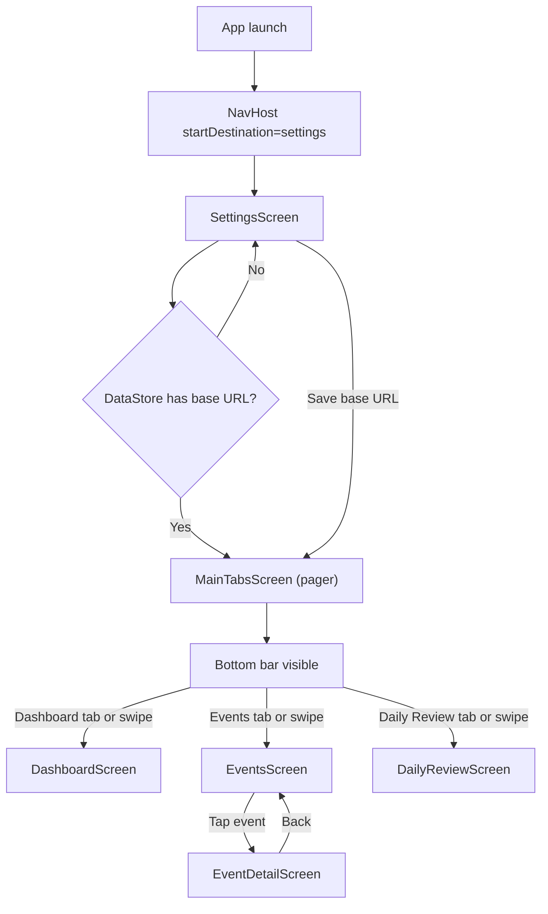

# Frigate Event Viewer — UI Map

**This file is the source of truth for Compose UI and navigation.** See `map.md` for project structure and data flow.

---

## Rules for AI

Whenever a new screen or navigation route is added to the app, the AI agent **MUST** update this document and its Mermaid flowcharts to reflect the new architecture before marking the task as complete.

---

## Design System & UI Guidelines

Apply these rules across all screens to keep the app visually consistent.

- **Screen headers:** The three main tab screens (Dashboard, Events, Daily Review) use a large top-app-bar style title at the top of their main content: `MaterialTheme.typography.headlineLarge`, with **16.dp** horizontal and top padding and **8.dp** bottom spacing before the body content. Main screen headers include a **settings navigation icon on the right** that navigates to the settings route; back from Settings returns to the main tabs.
- **Nested screens (Settings, Event detail):** Use a **TopAppBar** with title and **navigationIcon** = `IconButton` + `Icons.AutoMirrored.Filled.ArrowBack` for consistent back styling. These screens also use **full-width swipe-back** via **SwipeBackBox** (see `ui/util/SwipeBack.kt`): a rightward swipe from anywhere on the screen triggers back (same feel as swiping between tabs). Vertical scroll is preserved: the gesture is only consumed when horizontal movement exceeds the threshold and dominates vertical movement.
- **Container margins:** Main screen containers use uniform **16.dp** horizontal padding so content aligns cleanly to the screen edges. Avoid double-padding inner children (e.g. do not add extra horizontal padding inside a Column that already sits in a padded container).
- **Shapes:** Major UI elements (video players, cards, action buttons) use **12.dp** rounded corners: `RoundedCornerShape(12.dp)`. Do not use the default Compose pill shape for primary action buttons; use the 12.dp shape to match video and cards.
- **Action buttons:** Rows of action buttons must stay **single-line** at **40.dp** height. Use `Modifier.height(40.dp)` and `Text(..., maxLines = 1)`. When button labels vary in length, use `Modifier.weight(...)` so the middle/longer label has more space (e.g. `weight(1.4f)` for "Mark Reviewed") and side buttons use `weight(1f)` to avoid wrapping.
- **Video players:** Use a **16:9** aspect-ratio container (`Modifier.aspectRatio(16f / 9f)`), **RESIZE_MODE_ZOOM** so the frame is filled, and a **1-second (1000ms)** controller timeout (`controllerShowTimeoutMs = 1000`).

---

## 1. Navigation flowchart

**Flow summary:**

- **App launch:** NavHost starts at route `"settings"`.
- **Launch decision:** A `LaunchedEffect(Unit)` in MainActivity calls `SettingsPreferences.getBaseUrlOnce()`. If non-null, navigates to `"main_tabs"` (MainTabsScreen) and pops `"settings"` so back does not return to first-run.
- **First run:** User stays on SettingsScreen until they enter a URL and tap Save (or launch decision already sent them to the tabbed main screen).
- **After Save:** `onNavigateToDashboard` runs → navigate to `"main_tabs"`, pop `"settings"` inclusive.
- **Bottom bar + pager:** MainTabsScreen owns a `Scaffold` with a bottom bar and a `HorizontalPager` with three pages: Dashboard, Events, and Daily Review. Tapping Dashboard, Events, or Daily Review animates the pager to the corresponding page; swiping between pages also updates the selected bottom bar item.
- **Event detail:** From EventsScreen (inside the pager), tapping an event card sets `SharedEventViewModel.selectedEvent` and navigates to `"event_detail"`. EventDetailScreen shows video, actions (Mark Reviewed, Keep, Delete), and metadata. Back (toolbar or system) clears selection and pops to the previous screen.

---

## 2. Screen inventory

### SettingsScreen

- **Route:** `"settings"`
- **Purpose:** First-run / onboarding; also reachable from main tabs via the header settings icon. User enters the Frigate Event Buffer server base URL, can test connection (GET `/status`), and saves. After save (when coming from first-run), app navigates to dashboard and removes settings from back stack. When opened from main tabs, a TopAppBar with back icon is shown and back (or full-width swipe) returns to main tabs.
- **ViewModel:** `SettingsViewModel` (factory: `SettingsViewModelFactory`).
- **States:**
  - `urlInput: StateFlow<String>` — current text in the URL field.
  - `connectionTestState: StateFlow<ConnectionTestState>` — `Idle` | `Loading` | `Success` | `Error(message)`.
- **Data source:** `FrigateApiService.getStatus()` for "Test connection". DataStore for `saveBaseUrl` / `getBaseUrlOnce`.

---

### DashboardScreen

- **Route:** Hosted as page 0 inside `"main_tabs"` (MainTabsScreen pager)
- **Purpose:** Shows event stats (today, this week, this month, unreviewed) and storage usage. Pull-to-refresh and retry on error. Data refreshes when the tab is selected and when the app is opened or brought from background.
- **ViewModel:** `DashboardViewModel` (factory: `DashboardViewModelFactory`).
- **States:** `DashboardState` — `Loading(previous?)` | `Success(stats)` | `Error(message, previous?)`.
- **Data source:** `FrigateApiService.getStats()`.
- **Refresh triggers:** init, pull-to-refresh, tab selected (current page), app resume (lifecycle `RESUMED` when this tab is visible).

---

### EventsScreen

- **Route:** Hosted as page 1 inside `"main_tabs"` (MainTabsScreen pager)
- **Purpose:** Lists unreviewed events with thumbnails (snapshot or clip), camera name, timestamp, label, and threat level. Pull-to-refresh, retry on error. List refreshes when the user returns from event detail after Mark Reviewed / Keep / Delete, when the tab is selected, and when the app is opened or brought from background.
- **ViewModel:** `EventsViewModel` (factory: `EventsViewModelFactory`; requires `SharedEventViewModel` to observe `eventsRefreshRequested`).
- **States:** `EventsState` — `Loading` | `Success(response)` | `Error(message)`. Also exposes `baseUrl: StateFlow<String?>` for building media URLs.
- **Data source:** `FrigateApiService.getEvents(filter = "unreviewed")`.
- **Refresh triggers:** init, pull-to-refresh, `SharedEventViewModel.eventsRefreshRequested` (after event-detail actions), tab selected, app resume.

---

### DailyReviewScreen

- **Route:** Hosted as page 2 inside `"main_tabs"` (MainTabsScreen pager)
- **Purpose:** View the current daily review report (Markdown) and trigger report generation. Pull-to-refresh to refetch without regenerating. Renders markdown via mikepenz M3; FAB "Generate New Report" calls generate endpoint then refetches. On 404 (no report for today) shows a friendly message and Retry. Data refreshes when the tab is selected and when the app is opened or brought from background.
- **ViewModel:** `DailyReviewViewModel` (factory: `DailyReviewViewModelFactory`). Receives viewModel from MainTabsScreen (same instance for the pager).
- **States:** `DailyReviewState` — `Idle` | `Loading` | `Success(markdownText)` | `Error(message)`.
- **Data source:** `FrigateApiService.getCurrentDailyReview()`, `FrigateApiService.generateDailyReview()`.
- **Refresh triggers:** init, pull-to-refresh (`refresh()`), after Generate New Report, tab selected, app resume.

---

### EventDetailScreen

- **Route:** `"event_detail"`
- **Purpose:** Plays the event's .mp4 clip (Media3 ExoPlayer), shows actions (Mark Reviewed, Keep, Delete), and metadata (title, scene, camera, date, threat level). User can mark viewed, keep (move to saved), or delete; on Keep or Delete success the screen pops back (path changes / item removed). On any of the three actions, `onEventActionCompleted` is invoked so the events list refreshes (via `SharedEventViewModel.requestEventsRefresh()`). Selection comes from `SharedEventViewModel`; cleared on back.
- **ViewModel:** `EventDetailViewModel` (factory: `EventDetailViewModelFactory`). Also reads `SharedEventViewModel.selectedEvent` (from MainActivity).
- **States:** `EventDetailOperationState` — `Idle` | `Loading` | `Success(action)` | `Error(message)`. `baseUrl: StateFlow<String?>` for building clip URL.
- **Data source:** `FrigateApiService.markViewed`, `keepEvent`, `deleteEvent`. Clip URL via `buildMediaUrl(baseUrl, hosted_clip)` or first `hosted_clips[].url`.

---

## 3. UI components and helpers

### SwipeBackBox

- **Location:** `com.example.frigateeventviewer.ui.util.SwipeBack.kt`
- **Purpose:** Full-width swipe-right-to-go-back on nested screens (Settings, Event detail). A rightward swipe from anywhere triggers back, like swiping between tabs. Only consumes the gesture when horizontal movement exceeds the threshold and dominates vertical movement, so vertical scroll continues to work.
- **Used by:** SettingsScreen, EventDetailScreen.

### buildMediaUrl(baseUrl, path)

- **Location:** `com.example.frigateeventviewer.ui.util.MediaUrl.kt`
- **Purpose:** Builds the full media URL from the server base URL and an API path (e.g. `hosted_snapshot`, `hosted_clip`). Trims trailing slash from base URL to avoid double slashes. Returns `null` if either argument is null/blank.
- **Used by:** EventsScreen `EventCard` for thumbnail/clip URLs; EventDetailScreen for clip playback URL.

### EventDetailScreen — video and actions

- **Video:** AndroidView wrapping Media3 `PlayerView` and `ExoPlayer`. Clip URL from `buildMediaUrl(baseUrl, event.hosted_clip)` or first `event.hosted_clips[].url`. Player is paused on lifecycle `ON_PAUSE` (so audio does not continue in background) and released in AndroidView `onRelease`.
- **Actions:** Row of three buttons — Mark Reviewed (primary), Keep (tertiary; disabled if `event.saved`), Delete (error). Success(Delete) or Success(Keep) calls `onEventActionCompleted()` then pops back; Success(Mark Reviewed) calls `onEventActionCompleted()` (so the events list refreshes in the background), shows Snackbar, and stays.

### Coil and video thumbnails

- **Application:** `FrigateEventViewerApplication` implements Coil `ImageLoaderFactory` and registers `VideoFrameDecoder.Factory()` so video URLs (e.g. .mp4 clip paths) can be used as image sources (first frame decoded).
- **Usage:** Use the default Coil `ImageLoader` (do not create ad-hoc loaders). For video URLs, build an `ImageRequest` with `videoFrameMillis(2000L)` (or desired offset) so Coil uses the decoder to show a frame. Example: EventsScreen `EventCard` uses `AsyncImage` with `ImageRequest.Builder(context).data(url).videoFrameMillis(2000L).build()`.
- There is no separate "StreamingVideoFetcher" component; the app uses Coil’s `VideoFrameDecoder` as above.
